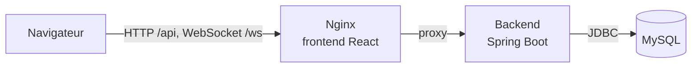
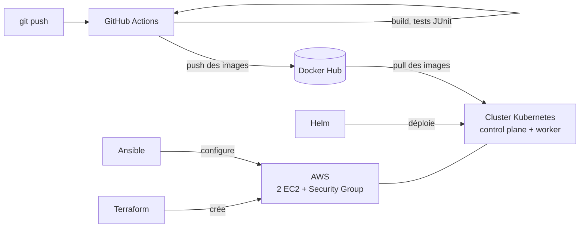

#  Blazing 8s 🃏

Jeu de cartes multijoueur en temps réel, inspiré du Uno (React, Spring Boot, MySQL, WebSocket). Ce dépôt contient l'application et toute sa chaîne d'industrialisation : conteneurisation, intégration continue, infrastructure AWS décrite en code avec Terraform, cluster Kubernetes installé avec Ansible et déploiement avec Helm.


## Sommaire

- [Le jeu](#le-jeu)
- [Architecture applicative](#architecture-applicative)
- [Architecture DevOps](#architecture-devops)
- [Structure du dépôt](#structure-du-dépôt)
- [Lancer en local](#lancer-en-local)
- [Déployer sur AWS](#déployer-sur-aws)
- [Choix techniques et limites](#choix-techniques-et-limites)
- [Stack](#stack)
- [Équipe](#équipe)

## Le jeu

Le premier joueur à vider sa main gagne. À chaque tour, on joue une carte de même couleur ou de même valeur que celle du dessus de la défausse. Des cartes spéciales (inversion de sens, blocage, échange de main) rendent chaque partie imprévisible.

**Fonctionnalités**

- Inscription, connexion et classement général, persistés en base
- Salon d'attente (lobby) mis à jour en temps réel
- Jeu synchronisé entre tous les joueurs par WebSocket : chaque action est répercutée immédiatement sur tous les écrans
- Chat intégré en partie, persisté en base
- Gestion des déconnexions : si un joueur part, son tour est passé et la partie continue

## Architecture applicative



- **Frontend** : React 19 (Vite), construit en fichiers statiques et servi par **Nginx**. Nginx relaie `/api` (REST) et `/ws` (WebSocket) vers le backend, ce qui supprime toute URL codée en dur côté navigateur.
- **Backend** : Spring Boot 4. Huit entités JPA (`Player`, `Game`, `GamePlayer`, `GameTurn`, `Card`, `Deck`, `Ranking`, `Message`), un schéma MySQL maîtrisé (`ddl-auto=none`, script `init.sql`), WebSocket (JSR 356) pour le jeu et le chat, DTO pour découpler l'API des entités.
- **Supervision applicative** : Spring Boot Actuator expose `/actuator/health` (sondes de disponibilité Kubernetes) et `/actuator/prometheus` (métriques).

## Architecture DevOps



| Étape | Outil | Rôle |
|---|---|---|
| Intégration continue | **GitHub Actions** | Build Maven, tests JUnit, build des images Docker, push sur Docker Hub |
| Infrastructure | **Terraform** | 2 instances EC2 (Ubuntu 22.04), Security Group, clé SSH, sorties des IP |
| Configuration | **Ansible** | containerd, kubeadm, kubelet, kubectl ; création du cluster ; réseau Flannel ; jonction du worker |
| Déploiement | **Helm** | Chart `blazing` : MySQL, backend, frontend |
| Conteneurs | **Docker, Docker Compose** | Environnement local à 3 services |

**Pipeline CI** (`.github/workflows/ci.yml`) : quatre jobs enchaînés.

```
build (Maven) → test (JUnit) → docker-images → push-dockerhub
```

**Cluster Kubernetes** : 1 control plane + 1 worker, créé avec `kubeadm`. Dans le chart :

| Composant | Objets | Exposition |
|---|---|---|
| Frontend | Deployment (Nginx) + Service | **NodePort 30080** |
| Backend | Deployment (1 réplica) + Service, sonde de disponibilité | ClusterIP |
| MySQL | Deployment + Service + Secret + ConfigMap (`init.sql`) + volume `hostPath` | ClusterIP |

Les trois Deployments déclarent des `requests` et `limits` de CPU et de mémoire.

## Structure du dépôt

```
blazing-8s/
├── backend/                  # Spring Boot (+ Dockerfile multi-stage)
├── frontend/                 # React + Vite (+ Dockerfile, nginx.conf.template)
├── docker-compose.yml        # environnement local
├── .github/workflows/ci.yml  # pipeline CI
├── terraform/                # infrastructure AWS
├── ansible/                  # installation du cluster Kubernetes
│   ├── site.yml
│   └── roles/                # common, containerd, kubernetes, control_plane, worker
└── helm/blazing/             # chart Helm de l'application
```

## Lancer en local

Prérequis : Docker et Docker Compose.

```bash
cp .env.example .env          # puis définir MYSQL_ROOT_PASSWORD dans .env
docker compose up -d --build
```

| Service | Adresse |
|---|---|
| Application | http://localhost:5173 |
| API (via Nginx) | http://localhost:5173/api/ranking |
| Santé du backend | http://localhost:8080/actuator/health |
| MySQL | `localhost:3307` |

Deux comptes de test sont créés par `init.sql` : `amine` / `amine` et `houssam` / `houssam`.

## Déployer sur AWS

> ⚠️ Les ressources AWS sont facturées tant qu'elles existent. Détruire l'infrastructure à la fin de chaque session (étape 6).

**Prérequis** : compte AWS avec un utilisateur IAM (droits EC2) configuré via `aws configure`, Terraform, Ansible (sous Windows : via WSL), une paire de clés SSH `~/.ssh/blazing-key`, et les images publiées sur Docker Hub par la CI.

**1. Créer l'infrastructure**

```bash
cd terraform
cp terraform.tfvars.example terraform.tfvars    # renseigner my_ip = "VOTRE.IP/32"
terraform init
terraform apply
terraform output public_ips
```

**2. Configurer l'inventaire Ansible** avec les IP obtenues

```bash
cd ../ansible
cp inventory.yml.example inventory.yml          # remplacer les deux IP
ansible all -m ping
```

**3. Créer le cluster**

```bash
ansible-playbook site.yml
```

Le playbook est idempotent : un second lancement ne modifie rien (`changed=0`).

**4. Déployer l'application** depuis le control plane

```bash
ssh -i ~/.ssh/blazing-key ubuntu@<IP_CONTROL_PLANE>
kubectl get nodes                               # 2 nœuds Ready
curl -fsSL https://raw.githubusercontent.com/helm/helm/main/scripts/get-helm-3 | sudo bash
git clone https://github.com/rjafallah/blazing-8s.git && cd blazing-8s
helm install blazing helm/blazing --set mysql.password=<MOT_DE_PASSE>
kubectl get pods
```

**5. Jouer** : `http://<IP_WORKER>:30080`

**6. Détruire**

```bash
cd terraform && terraform destroy
```

Autres commandes Helm utiles : `helm list`, `helm upgrade blazing helm/blazing --set mysql.password=<MOT_DE_PASSE>`, `helm history blazing`, `helm rollback blazing 1`, `helm uninstall blazing`.

## Choix techniques et limites

**Choix**

- **kubeadm sur EC2** plutôt qu'un service managé (EKS) : le control plane managé est facturé en continu, et kubeadm expose le fonctionnement réel d'un cluster.
- **containerd** comme moteur de conteneurs (installé depuis le dépôt Docker), piloté directement par Kubernetes.
- **Flannel** pour le réseau de pods (réseau overlay).
- **VPC par défaut** d'AWS pour limiter la surface du code réseau.
- **Secrets** : aucun mot de passe réel dans le dépôt. Local : fichier `.env` ignoré par Git. Kubernetes : valeur passée à l'installation (`--set mysql.password=...`).
- **Pare-feu** : SSH et API Kubernetes limités à l'adresse IP de l'administrateur ; seule la plage NodePort est ouverte.

**Limites connues**

- **Un seul réplica du backend** : les sessions WebSocket sont conservées en mémoire du processus ; plusieurs réplicas nécessiteraient un composant partagé (par exemple Redis).
- **Persistance MySQL via `hostPath`** : les données vivent sur le disque du worker. Suffisant pour une démonstration ; une plateforme réelle utiliserait un volume réseau (PV/PVC, EBS).
- **Pas de HTTPS** : l'accès se fait en HTTP par NodePort.
- **Mots de passe des joueurs stockés en clair** dans l'application (hérité du projet de départ) : un hachage BCrypt est à prévoir.
- **Tests automatisés limités** : les tests unitaires portent principalement sur les entités.
- **Déploiement manuel** : Terraform, Ansible et Helm sont lancés à la main. La CI construit et publie les images, mais le déploiement n'est pas encore piloté par la pipeline (images taguées `latest`, état Terraform local).

## Stack

| Domaine | Technologies |
|---|---|
| Backend | Java 17, Spring Boot 4, Spring Data JPA, Spring WebSocket, Hibernate, Maven |
| Frontend | React 19, Vite, Nginx |
| Base de données | MySQL 8 |
| Conteneurs | Docker, Docker Compose, Docker Hub |
| CI | GitHub Actions |
| Infrastructure | AWS (EC2, VPC, Security Groups), Terraform |
| Configuration | Ansible |
| Orchestration | Kubernetes (kubeadm, containerd, Flannel), Helm |
